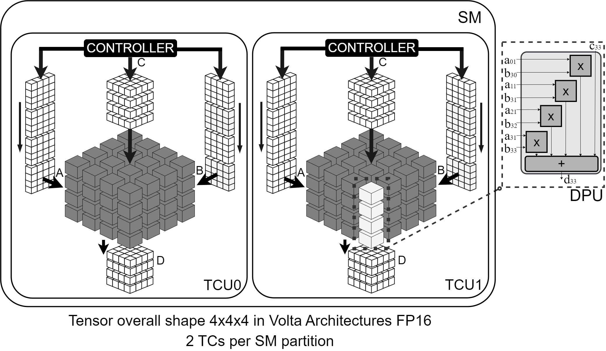

#  TC_core

*RTL Low-level micro-architecture description of the datapath of Tensor Cores (Tensor Core Units, or Matrix Cores)*

---

## 🧩 Overview

This repository collects several fundamental blocks used in the Datapath of Tensor Core units (an in-chip hardware accelerator commonly found in GPUs and processors) [ [1] ](https://www.computer.org/csdl/proceedings-article/ispass/2019/08695642/19wBevIF5T2) [ [2] ](https://patents.google.com/patent/US10338919B2/en) [ [3] ](https://ieeexplore.ieee.org/abstract/document/9007413)

A Tensor Core Unit (TCU), also referred to as a Matrix Core, is a Domain-Specific Architecture (DSA) designed to accelerate $m \times n \times k$ matrix multiplications and serves as a fundamental building block in modern AI accelerators, commonly integrated into today’s processors and GPUs. At their core, they execute the fused matrix operation:

where $A$ and $B$ are the input matrices with shapes ($m \times k$) and ($k \times n$), respectively. Moreover, $C$ and $D$, with ($n \times m$) shapes, represent the accumulation and output matrices, respectively. The operating format might use half- (FP16) or single-precision (FP32) floating point, as well as integer (INT) or custom formats, e.g., Posit16, Posit32, or FP8.

As shown in the illustration, a $4 \times 4 \times 4$ TCU comprises **16** Dot-Product Units (DPUs). Each DPU contains a layer of multipliers followed by multiple layers of adders, forming the pipeline that performs high-throughput matrix multiplications. 
Importantly, every adder and multiplier is itself built from lower-level components such as shifters, lead-zero counters (LZCs), and integer adders/multipliers, illustrating the hierarchical design complexity of the accelerator.

The synthesizable VHDL IP cores are designed for ease of integration as a coprocessor or accelerator on Processor-based systems.

Ideal for [your use case: e.g., embedded systems, SoC design, digital signal processing], it offers:

<!--- ✅ Standards-compliant design ([e.g., AXI4-Lite, AMBA, Wishbone]) -->
- 🔧 Configurable parameters
- 🧪 Fully testbenched with simulation support
- 📚 Clean documentation with example integrations

## 📁 Directory Structure

    TC_core/
    │
    ├── README.md               # Overview of the project
    │
    ├── DPU_core/
    │   ├── DPU_FP_32           # HDL files of the DPU description
    │   ├── files               # Scripting files for running the TB through ModelSim
    │   └── TB                  # TB files for DPU
    │
    ├── TCU_FP32_pipe/
    │   ├── HW_sources          # HDL files for the integration of DPUs as the TCU core
    │   └── TB                  # TB files for the verification of the TCU core
    ├──                         # Other shapes and number formats TCs

# 🎲 Architectural Simulation Tools

The [**PyopenTCU**](https://github.com/TheColombianTeam/PyOpenTCU) tool is an architectural description of the TCU core that includes the scheduling, dispatching, and memory hierarchy management (i.e., register files and buffers), according to SASS MMA instructions [ [1] ](https://www.computer.org/csdl/proceedings-article/ispass/2019/08695642/19wBevIF5T2) [ [4] ](https://ieeexplore.ieee.org/document/10321881).

# 🎲 Additional documentation

- [Analyzing the Impact of Different Real Number Formats on the Structural Reliability of TCUs in GPUs](https://ieeexplore.ieee.org/document/10321881)

- [Exploring Hardware Fault Impacts on Different Real Number Representations of the Structural Resilience of TCUs in GPUs](https://www.mdpi.com/2079-9292/13/3/578)
  
- [Analyzing the Reliability of TCUs Through Micro-architecture and Structural Evaluations for Two Real Number Formats](https://link.springer.com/chapter/10.1007/978-3-031-70947-0_8)

- [Effective Application-level Error Modeling of Permanent Faults on AI Accelerators](https://ieeexplore.ieee.org/abstract/document/10616087)

- [Analyzing the Impact of Scheduling Policies on the Reliability of GPUs Running CNN Operations](https://ieeexplore.ieee.org/abstract/document/10538940)

## 🙌 Credits

- Project developed by Josie E. Rodriguez Condia, [Robert Limas Sierra](https://github.com/robalexlimas), [Juan David Guerrero B.](https://juandavid-guerrero.github.io/).  
- [Electronic CAD & Reliability Group](https://cad.polito.it/)
- Department of Control and Computer Engineering (DAUIN), Politecnico di Torino, Turin, Italy.
  

## 📬 Contact

For questions, suggestions, or collaboration, feel free to reach out:

- **Name:** Josie E. Rodriguez Condia
- **Email:** josie.rodriguez@polito.it  
